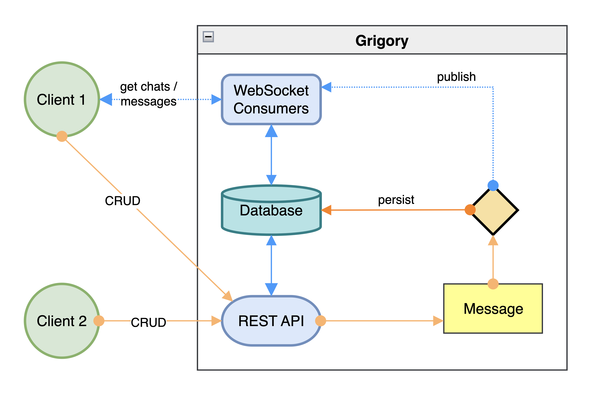

# Grigory

Grigory is just another messaging service. It's built on top of Django and Django Channels.  
It's designed to be used as a microservice in a microservice architecture, 
but can be used as a standalone service as well.  
It provides both REST API and WebSockets for clients and microservices.  



### How it works

Any microservice or client just sends some message via REST API or WebSockets with the indication of the chat it belongs to.  
This message first goes to queue to avoid overloading the database.  
Then it's processed by the worker and saved to the database. If specified chat doesn't exist, it's created automatically.
After that, the message is sent to the chat via WebSockets.  

Message history can be retrieved via REST API or WebSockets.  
  
#### Demo
  
You can try the demo at [https://grigory-demo.anttek.io/admin](https://grigory-demo.anttek.io/admin).  
  
Admin user is `demo` and password is `demo-123`.  
  
API is available at [https://grigory-demo.anttek.io/api](https://grigory-demo.anttek.io/api).  
WebSockets are available at [wss://grigory-demo.anttek.io/ws](wss://grigory-demo.anttek.io/ws).  


### Features implemented

- [x] Expiring Token authentication
- [x] WebSockets with Token authentication
- [x] Microservice architecture-ready (with [DJ-MS Auth Router](https://github.com/dj-ms/dj-ms-auth-router))
- [x] REST API both for clients and for microservices


### Features to be implemented

- [ ] Chat management
- [ ] Using system events as messages in chats
- [ ] Marking messages as read by concrete user


### Quick start

#### 1. Clone the repo

```bash
git clone https://github.com/Anttek-io/grigory.git
```

#### 2. Enter the directory and start Compose project

```bash
cd grigory
docker compose up -d
```


## Postman workspace

There's public Postman workspace with all the requests and collections.
You can import it to your Postman and start testing the API right away.
  
[](https://www.postman.com/anttek-io/workspace/grigory)
