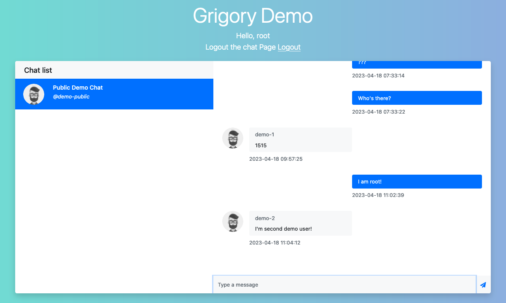

# Grigory  
  
[](https://github.com/Anttek-io/grigory/actions/workflows/django.yml)
[](https://hub.docker.com/r/anttek/grigory)
[](https://hub.docker.com/r/anttek/grigory)
[](https://hub.docker.com/r/anttek/grigory)  
  
Grigory is backend for notification service, real-time chats and microservices communication.  
It's built on top of Django and Django Channels.  
It's designed to be used as a microservice in a microservice architecture, 
but can be used as a standalone service as well.  
It provides both REST API and WebSockets for clients and microservices.  

**If you find this project useful, please consider giving it a star ⭐️**
  
## Who was this project made for?
  
Everybody who wants to implement chat and notifications in their project.  
For example, frontend developers who needs chat and/or notifications functionality.  
  
---
  
## How it works
  
  
  
1. Any microservice or client just sends some message via REST API or WebSockets 
with the indication of the chat it belongs to.
If specified chat doesn't exist, it's created automatically.
2. This message first goes to queue to avoid overloading the database.  
3. Then it's processed by the worker and saved to the database.  
4. After that, the message is sent to real-time chat via WebSockets.

Message history can be retrieved via REST API or WebSockets.  
  
### Demo
  
> Grigory needs some pretty demo site. But I'm bad at frontend, so if you want to help,
> please contact me at [rustam@astafeev.dev](mailto:rustam@astafeev.dev).
  

  
You can try the demo at [https://grigory-demo.anttek.io](https://grigory-demo.anttek.io).  
To test it, open 2 tabs in your browser and login as 2 different users.  
Then you can send messages between them.  
  
> There are 2 users in the demo: `demo-1` and `demo-2`.  
> They have same password: `demo-123`.  
  
API is available at [https://grigory-demo.anttek.io/api](https://grigory-demo.anttek.io/api).  
WebSockets are available at `wss://grigory-demo.anttek.io/ws`.
  
---
  
## Features implemented
  
- [x] WebSockets with JWT auth (with [Rest Framework Simple JWT](https://rest-framework-simplejwt.readthedocs.io/en/latest/))
- [x] Real-time chats and chat list
- [x] Chat management (creating, updating, deleting, adding and removing members, etc.)
- [x] File attachments via REST API only (because there's limitation for message size in Django Channels / Redis)
- [x] Microservice architecture-ready
  
## Features to be implemented

- [ ] Marking messages as read by concrete user
- [ ] Show unread messages count in chat list
- [ ] Using system events as messages in chats
  
---
  
## Quick start
  
First clone the repo
  
```bash
git clone https://github.com/Anttek-io/grigory.git
cd grigory
```
  
Create `.env` file and put at least `GRIGORY_WEB_PORT`  
```shell
GRIGORY_WEB_PORT=8000
```
  
Run the app  
```bash
docker compose up -d
```
  
---
  
## Documentation
  
Hand-writed docs available here: [link to GitHub Pages](https://anttek-io.github.io/grigory/).
  
Demo auto-generated docs available here: [link to RapiDoc UI](https://grigory-demo.anttek.io/api/docs/).
  
---
  
## Postman workspace

There's public Postman workspace with all the requests and collections.
You can import it to your Postman and start testing the API right away.
  
[](https://www.postman.com/anttek-io/workspace/grigory)
  
---
  