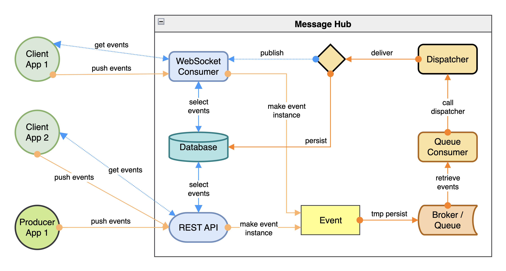
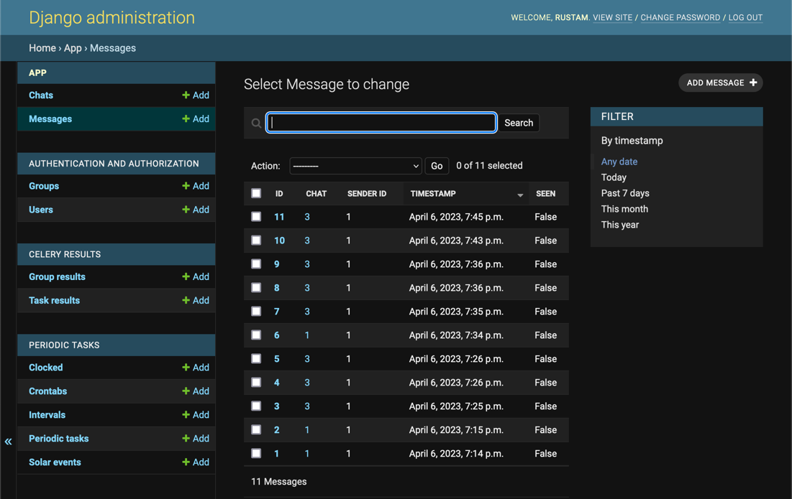
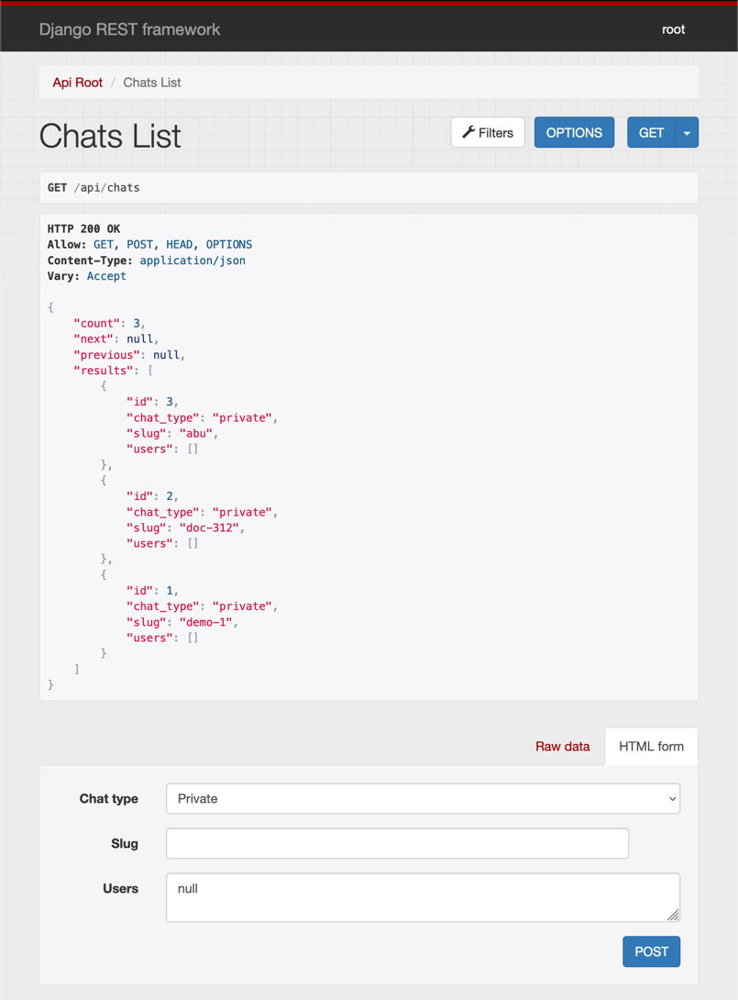

# Grigory  
  

  
  
Grigory is backend for notification service, real-time chats and microservices communication.  
You don't need to implement all the logic for chats and notifications from scratch.  
For example, you can just run Grigory and use it as backend for your chat and notifications.  
It's built on top of Django and Django Channels.  
It's designed to be used as a microservice in a microservice architecture, 
but can be used as a standalone service as well.  
It provides both REST API and WebSockets for clients and microservices.  

**If you find this project useful, please consider giving it a star ⭐️**
  
## Who was this project made for?
  
Everybody who wants to implement chat and notifications in their project.  
For example, frontend developers who needs chat and/or notifications functionality.  
Or backend developers who need to implement chat and notifications in their project.
> If you're main backend is made on Django, you can use Grigory as a part of your microservice architecture.  
> Just add `AUTH_DB_URL` environment variable that points to your main Django database.  
> After that Grigory will use your main Django database for authentication.  
  
---
  
## How it works
  
  
  
1. Any microservice or client just sends some message via REST API or WebSockets 
with the indication of the chat it belongs to.
If specified chat doesn't exist, it's created automatically.
2. This message first goes to queue to avoid overloading the database.  
3. Then it's processed by the worker and saved to the database.  
4. After that, the message is sent to real-time chat via WebSockets.

Message history can be retrieved via REST API or WebSockets.  
  
> **If you find this project useful, please consider giving it a star ⭐️**
  
### Demo
  
|                                               |                                               |
|:---------------------------------------------:|:---------------------------------------------:|
|  |  |
  
You can try the demo at [https://grigory-demo.anttek.io/admin](https://grigory-demo.anttek.io/admin).  
API is available at [https://grigory-demo.anttek.io/api](https://grigory-demo.anttek.io/api).  
WebSockets are available at `wss://grigory-demo.anttek.io/ws`.  
  
> Demo admin user is `demo` and password is `demo-123`.  
  
---
  